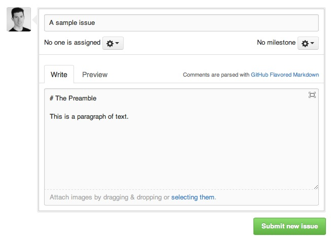

Markdown is a lightweight and easy to use syntax for styling all forms of writing on the GitHub platform.

**What you will learn:**

* How the Markdown format makes styled collaborative editing easy
* How Markdown differs from traditional formatting approaches
* How to use Markdown to format text
* How to leverage GitHub’s automatic Markdown rendering
* How to apply GitHub’s unique Markdown extensions

## What is Markdown?

Markdown is a way to style text on the web. Bold, italics, font size, images, and lists are just a few of the things we can do with it.

** [Here’s an example from the GitHub API developer documentation](https://github.com/github/developer.github.com). **

## A little bit about the format

Imagine you have a document with several paragraphs. You think, “This would look best if I could do some formatting such as a header for a paragraph, like I would in a traditional word processor.”

To practice this, [create a new practice issue](https://github.com/githubtraining/sample-markdown/issues/new) and type a bit of text in the comment section with a "#" in front to denote your header. You have now created the first heading of your document.

Click the Preview tab to see a rendered view of your Markdown.

## Special Flavors
Depending on the location of where we're writing markdown, we may have a few additional sets of styling we can use Markdown for.

### Comment Boxes
Comments have a nice set of additional Markdown syntax that writing in files don't, these relate to sets of data that may change or be updated.

* TaskList
* SHA References
* Issues references in same repo
* Username @mentions
* Cross-repository memtions with username/repo#issue
* Automatic linking for URLs
* Emoji

### Markdown Files + Comment Boxes
Special Markdown that is everywhere including files are more related to text and not dynamic content.

* Strikethrough
* Code fences to show formated code examples
* Syntax highlighting for code blocks with language definition
* Relative image linking within repository

## Basic Use Beyond Issues

### Pull Requests
Pull Request work just like Issues, only discussion is about code. Comment on a Pull Request just like you would an issue.

### Gists
Gists are a perfect place to have small snippets of text for Markdown files. Whether these are code examples or small notes to yourself, gists make it perfect to create things fast.

### Files

Files ending in ".md" are rendered on GitHub to allow you to write more rich content using GitHub Flavored Markdown. Many people first do this with their README for their repository to give people an idea of what their project may be about and how to use it.

