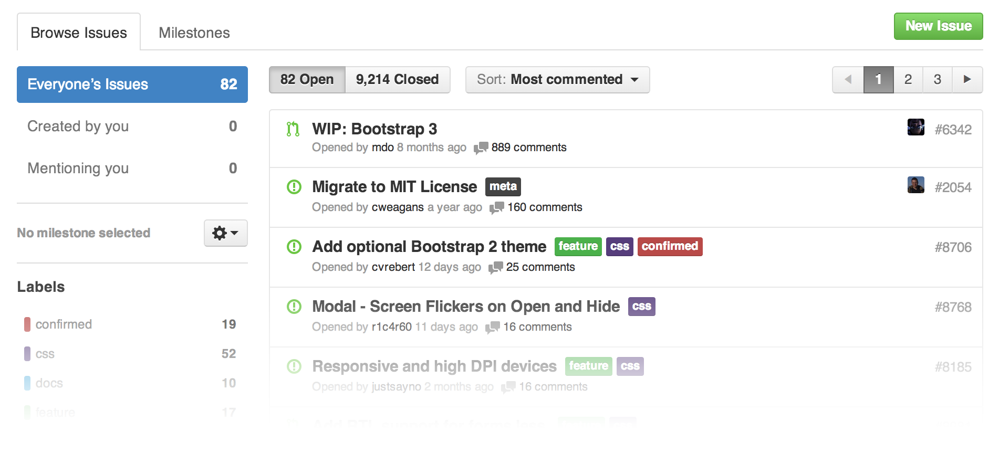
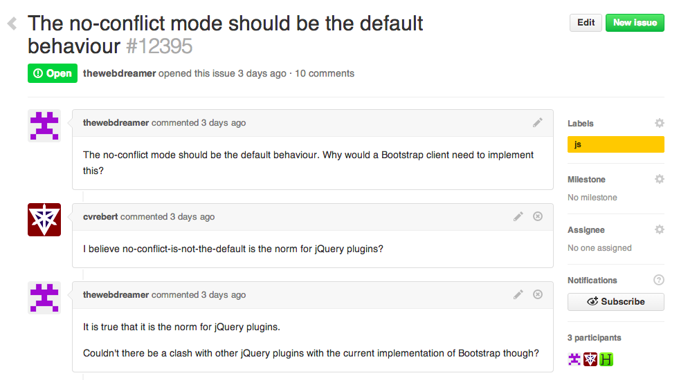
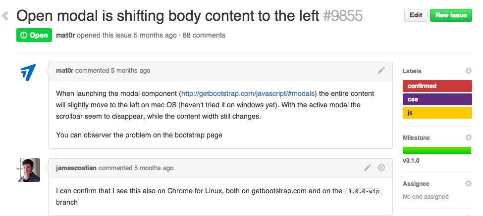
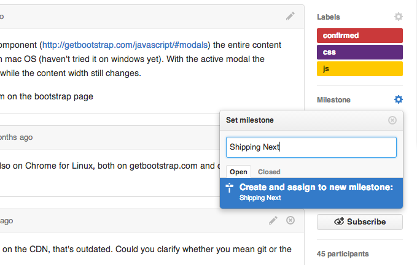
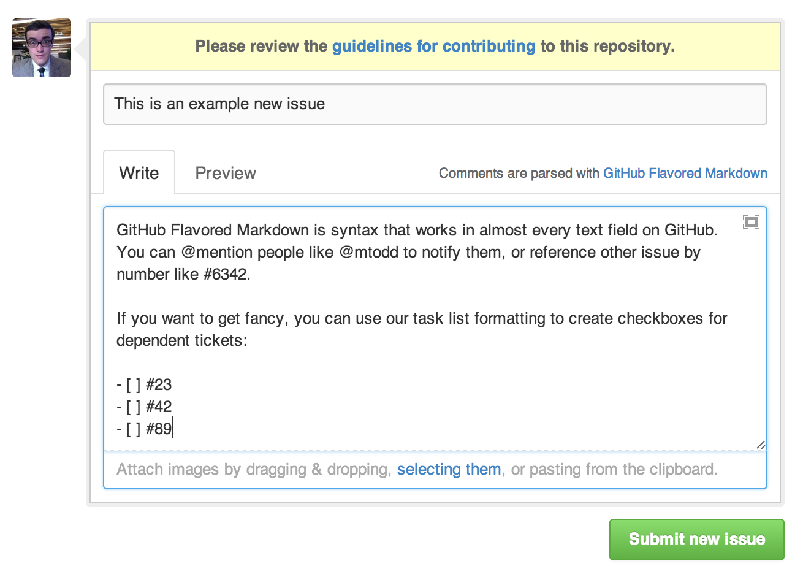
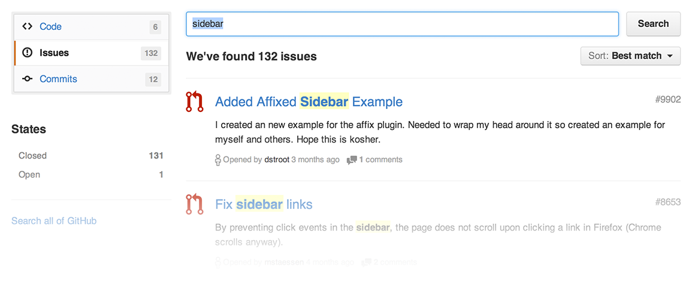
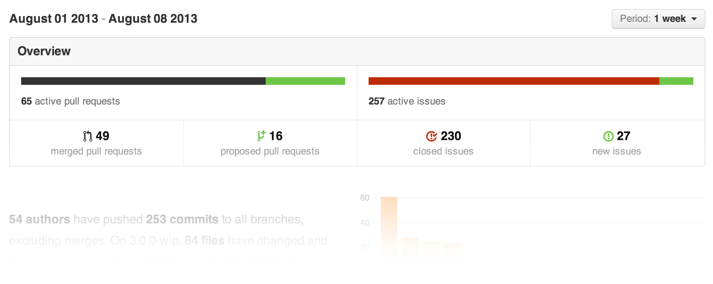

Issues are a great way to keep track of tasks, enhancements, and bugs for your projects. They're kind of like email—except they can be shared and discussed with the rest of your team. Most software projects have a bug tracker of some kind. GitHub's tracker is called **Issues**, and has its own section in every repository.

For example, let's take a look at <a href="https://github.com/twbs/bootstrap/issues" target="_blank">Bootstrap's Issues section</a>:

GitHub's issue tracking is special because of our focus on collaboration, references, and excellent text formatting. A typical issue on GitHub looks a bit like this:

* A **title and description** describe what the issue is all about.

* Color-coded **labels** help you categorize and filter your issues (just like labels in Gmail).

* A **milestone** acts like a container for issues. This is useful for associating issues with specific features or project phases (e.g. *Weekly Sprint 9/5-9/16* or *Shipping 1.0*).

* One **assignee** is responsible for working on the issue at any given time.

* **Comments** allow anyone with access to the repository to provide feedback.

## Milestones, Labels, and Assignees

Once you've collected a lot of issues, you may find it hard to find the ones you care about. **Milestones**, **labels**, and **assignees** are great features to filter and categorize issues.

You can change or add a milestone, an assignee, and labels by clicking their corresponding gears in the sidebar on the right.

If you don't see edit buttons, that's because you don't have permission to edit the issue. You can ask the repository owner to add you as a collaborator to get access.

### Milestones

Milestones are groups of issues that correspond to a project, feature, or time period. People use them in many different ways in software development. Some examples:

* **Beta Launch** — File bugs that you need to fix before you can launch the beta of your project. It's a great way to make sure you aren't missing anything.

* **October Sprint** — File issues that you'd like to work on in October. A great way to focus your efforts when there's a lot to do.

* **Redesign** — File issues related to redesigning your project. A great way to collect ideas on what to work on.

### Labels

Labels are a great way to organize different types of issues. Issues can have as many labels as you want, and you can filter by one or many labels at once.

### Assignees

Each issue can have an assignee — one person that's responsible for moving the issue forward. Assignees are selected the same way milestones are, through the grey bar at the top of the issue.

## Notifications, @mentions, and References

By using @mentions and references inside of Issues, you can notify other GitHub users & teams, and cross-connect issues to each other. These provide a flexible way to get the right people involved to resolve issues effectively, and are easy to learn and use. They work across all text fields on GitHub — they're a part of our text formatting syntax called [GitHub Flavored Markdown](https://help.github.com/articles/github-flavored-markdown).

If you'd like to learn more, have a look at **[Mastering Markdown](http://guides.github.com/overviews/mastering-markdown/)**.

### Notifications

<a href="https://github.com/notifications" target="_blank">Notifications</a> are GitHub’s way to keep up to date with your Issues. You can use them to find out about new issues on repositories, or just to know when someone needs your input to move forward on an issue.

There are two ways to receive notifications: via email, and via the web. You can configure how you receive notifications <a href="https://github.com/settings/notifications" target="_blank">in your settings</a>. If you plan on receiving a lot of notifications, we like to recommend that you receive web + email notifications for **Participating** and web notifications for **Watching**.

With these settings, you receive emails when people specifically mention you, then visit the web-based interface to keep up to date with repositories you're interested in.

You can access your notifications through the <a href="https://github.com/notifications" target="_blank">notifications</a> screen. This screen is nice for scanning many notifications at once and marking them as read or muting the thread. Try using keyboard shortcuts to speed up your workflow here — press `?` on the page to see which shortcuts are available.

Muted threads won’t show up as unread again until you are specifically @mentioned again. This makes muting a great strategy for threads that you have little interest in (perhaps a sub-system that you aren’t familiar with). If you mark an issue as read, it will stay that way until someone comments on the thread again.

GitHub also syncs read/unread status for email notifications — if you read a notification in your email client, it will be marked as read in the web-based interface (make sure you allow your email client to display images if you’d like this functionality).

### @mentions

@mentions are the way that we reference other GitHub users inside of GitHub issues. Inside of the description or any comment of the issue, include the @username of another GitHub user to send them a notification. This works very similar to how Twitter uses @mentions.

We like to use the `/cc` syntax (an abbreviation for carbon copy) to include people in issues:

> It looks like the new widget form is broken on Safari. When I try and create the widget, Safari crashes. This is reproducible on 10.8, but not 10.9. Maybe a browser bug?
>
> /cc @kneath @jresig

This works great if you know the specific users to include, but many times we’re working across teams and don’t really know who might be able to help us. @mentions also work for Teams within your GitHub organization. If you create a Team called *browser-bugs* under the @acmeinc organization, you can reference the team with @mentions:

> /cc @acmeinc/browser-bugs

This will send notifications to every member of the browser-bugs team.

### References

Often times issues are dependent on other issues, or at least relate to them and you'd like to connect the two. You can reference issues by typing in a hashtag plus the issue number.
> Hey @kneath, I think the problem started in #42

When you do this, we'll create an event inside of issue #42 that looks something like this:

Issue in another repository? Just include the repository before the name like `kneath/example-project#42`.

One of the more interesting ways to use GitHub Issues is to reference issues directly from commits. Include the issue number inside of the commit message.

By prefacing your commits with "Fixes", "Fixed", "Fix", "Closes", "Closed", or "Close" when the commit is merged into master, it will also automatically close the issue.

References make it possible to deeply connect the work being done with the bug being tracked, and are a great way to add visibility into the history of your project.

## Search

At the very top of each page is a search box that lets you search through issues.

* <a href="https://github.com/twbs/bootstrap/search?q=sidebar&type=Issues" target="_blank">All issues mentioning the sidebar</a>

* <a href="https://github.com/twbs/bootstrap/search?q=sidebar&state=open&type=Issues" target="_blank">...that are open</a> (check out the links on the left hand sidebar to filter open/closed)

* <a href="https://github.com/twbs/bootstrap/search?q=assignee%3Amdo&ref=cmdform&type=Issues" target="_blank">Assigned to @mdo</a>

* <a href="https://github.com/search?q=sidebar&ref=reposearch&state=open&type=Issues" target="_blank">Or search issues throughout all of GitHub by clicking the link in the sidebar</a>

Visit our <a href="https://github.com/search/advanced?q=sidebar&ref=reposearch&state=open&type=Issues" target="_blank">advanced search</a> page to learn other ways of searching through issues: using created/updated dates, labels, authors, comment counts, by repository owner, and more.

## Overviews & Reports

Outside of the Issues section, there are two other pages that help summarize what's going on with Issues across your repository and across all of your repositories.

### The Issue Dashboard

If you're looking for a broader listing of all of your issues across many projects, the <a href="https://github.com/dashboard/issues" target="_blank">Issues Dashboard</a> can be a great tool. The dashboard works very similar to the issues section, but collects issues differently:

* All issues in repositories you own and collaborate on
* Issues assigned to you
* Issues you've created

If you use organizations, each of your organizations has it's own Issues dashboard that separates out Issues within the organization.

### Pulse

Underneath each repository is a section called **Pulse** — Pulse is a snapshot of everything that's happened in the repository in the past week (or day, or past 3 months, etc).

It's a great way to catch up with repositories when you've been away and don't want the granularity notifications offer when watching a repository.

## Other Uses for Issues

Issues are great for tracking all kinds of things — and GitHub is a great place to easily share and collaborate on your issues.  Here's some of our favorites:

* <a href="https://github.com/frabcus/house/issues?labels=building&state=open" target="_blank">Bug tracker for your house</a> including such gems as <strong><a href="https://github.com/frabcus/house/issues/58" target="_blank">the door being hung incorrectly</a></strong>

* <a href="https://github.com/joyent/node/issues" target="_blank">Bug tracker for your open source projects</a>

* <a href="https://github.com/newmerator/recipes/issues" target="_blank">Request for recipes</a> (maybe you have a good <strong><a href="https://github.com/newmerator/recipes/issues/3" target="_blank">gluten-free pizza dough recipe</a>?</strong>)

## Fin

**Now congratulate yourself** — that was a lot to read! Issue management is one of the most powerful tools at any developer's disposal. I guess all that's left is to actually fix the bugs now. Sounds boring.
