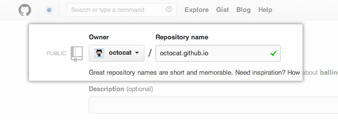
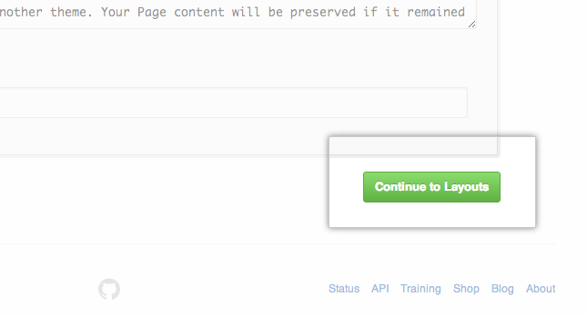
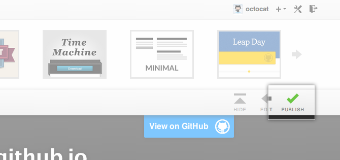

GitHub Pages are public webpages freely hosted and easily published through GitHub. The quickest way to get up and running is by using the Automatic Page Generator to create some starter HTML and CSS for us. Once created, we will be able to create additional changes to this content and style in the web or on our desktop.

## Create Your Website

Once we're <a href="https://github.com/login" target="_blank">signed in</a> we will create a new repository to get started.

Once on the new repository screen, we need to name this repository something special for generating our website.

This repository, `username.github.io`, will be where all of the HTML and CSS lives that makes up our website. Make sure when naming it, that we name it after our actual username, not the word 'username'. To have this initial set of HTML and CSS for us, we have to first go over to the settings tab to enable the automatic page generator.

Scrolling down near the bottom of the options, we see a button labeled "Automatic Page Generator". Clicking this will start off the process for our content being automatically created for us.

When we click this, we're directed to the first step of generating the page: The Content. We can go ahead and keep this default content and make changes to it later. Let's go ahead and click `Continue to Layouts` at the bottom of the page.

Now, we pick our theme. This part requires a bit more thought, as the style we choose is slightly harder to update later. Take a look at some of the options at the top, and when you find one you love, click Publish at the top.

Once we click publish, GitHub does all the work to ensure when someone navigates to `username.github.io` it directs to your new website. This can take up to 10 minutes. After some time passes, feel free to open a new tab in your browser and go to your website!

## Making Changes

One of the first things we can do is remove the default title of our index page, and add a friendlier message to it. Since this is a very quick change -- and our first one -- we're going to make it on the default branch: `gh-pages`.

If we click on `index.html` to navigate into that file, we can make edits to it by selecting the edit button.

Let's find in this file where it says `username.github.io` and change this to a more friendly name. For the Octocat, I'm going to change it to "Welcome to the Octocat's Homepage". Feel free to do the same, except for your own username! Under this title, we should add a message about the purpose of the page and describe what we want people to do while they're here.

After we're done making this small change, scroll to the bottom of the page to make our first commit. We have two places to write about this change: a subject and an extended description. The extended description is optional, so let's leave a descriptive message in the subject.

