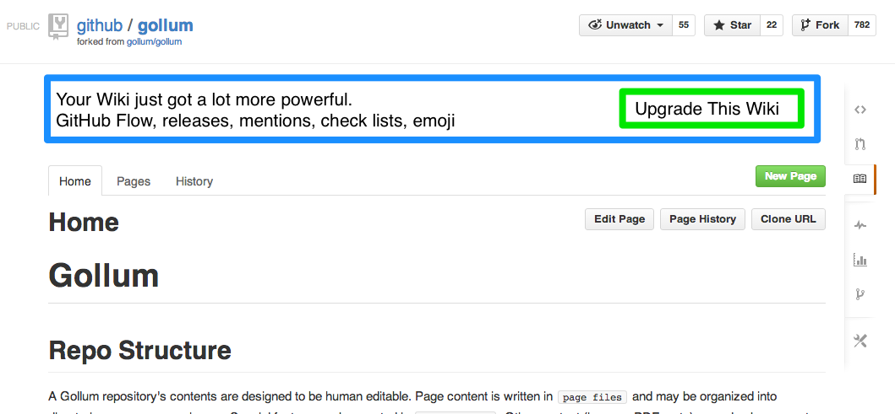

Good documentation is key to the success of any project. Making that documentation accessible enables people to learn about your project. Making it easy to update ensures that it stays relevant. **GitHub Wikis** are a great way to present information about a project in a readable way while making it easy for contributors to propose changes.

## Creating Your Wiki

Every repository on GitHub has a wiki. Starting your wiki is simply a matter of creating the first page.


## Adding a Page

Wiki content is designed to be human editable. By default, all your wiki content is stored in the `docs` directory of your repository,  which can be changed in your repository settings.

Wiki pages can be organized into directories any way you choose. Other content—like images or PDFs—can also be present and organized in the same way. Wiki pages can be written in any format supported by [GitHub Markup](http://github.com/github/markup). GitHub detects the page file format via the extension, so files must have one of the default or registered extensions in order to be converted.

The special page file `Home.ext` (where the extension is one of the supported
formats) will be used as the entrance page to your wiki. If it is missing, an
automatically generated table of contents will be shown instead.

## GitHub Flow

## Sidebar

Sidebar files allow you to add a simple sidebar to your wiki. Sidebar files
are named `_Sidebar.ext` where the extension is one of the supported formats.
Sidebars affect all pages in their directory and any subdirectories that do not
have a sidebar file of their own.

## Header & Footer

Header files allow you to add a simple header to your wiki. Header files must
be named `_Header.ext` where the extension is one of the supported formats.
Like sidebars, headers affect all pages in their directory and any
subdirectories that do not have a header file of their own.

Footer files allow you to add a simple footer to your wiki. Footer files must
be named `_Footer.ext` where the extension is one of the supported formats.
Like sidebars, footers affect all pages in their directory and any
subdirectories that do not have a footer file of their own.

## Html Sanitization

For security and compatibility reasons, wikis may not contain custom CSS
or JavaScript. These tags will be stripped from the converted HTML. See
`docs/sanitization.md` for more details on what tags and attributes are
allowed.

## Syntax Highlighting

In page files you can get automatic syntax highlighting for a wide range of
languages by using the following syntax:

    ```ruby
      def foo
        puts 'bar'
      end
    ```

The block must start with three backticks, at the beginning of a line or
indented with any number of spaces or tabs.
After that comes the name of the language that is contained by the
block. The language must be one of the `short name` lexer strings supported by
Pygments. See the [list of lexers](http://pygments.org/docs/lexers/) for valid
options.

The block contents should be indented at the same level than the opening backticks.
If the block contents are indented with an additional two spaces or one tab,
then that whitespace will be ignored (this makes the blocks easier to read in plaintext).

The block must end with three backticks indented at the same level than the opening
backticks.

## Upgrading Your Wiki

Wikis used to be stored in a separate repository from the main project. If your project has been around for a while, it might need to be upgraded. Click the "Upgrade This Wiki" button to merge your exisitng wiki content into your project's repository and to take advantage of all the latest features of Wikis.


