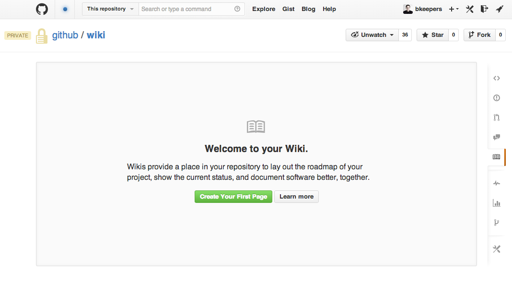

Good documentation is key to the success of any project. Making that documentation accessible enables people to learn about your project. Making it easy to update ensures that your documentation stays relevant. **Wikis** on GitHub help you present useful information about your project in a readable way, while also letting contributors propose changes.

## Creating Your Wiki

Every repository on GitHub has a wiki. Starting your wiki is simply a matter of creating the first page.



## Adding Pages

Wiki content is designed to be human editable. 

Wiki pages can be organized into directories any way you choose. Other content—like images or PDFs—can also be present and organized in the same way. Wiki pages can be written in any format supported by [GitHub Markup](http://github.com/github/markup). GitHub detects the page file format via the extension, so files must have one of the default or registered extensions in order to be converted.

The special page file `Home.ext` (where the extension is one of the supported formats) will be used as the entrance page to your wiki. If it is missing, an automatically generated table of contents will be shown instead.

## Including a Sidebar

By default, the sidebar will list all of the pages in your wiki. When you add new pages, they will be added to the sidebar.

If you would like to manage it yourself, click the "Edit" link in the sidebar and include whatever custom content that you would like to display on each page.

The sidebar content will be saved in a file named `_Sidebar` and, like wiki pages, can use any of format supported by [GitHub Markup](http://github.com/github/markup). Sidebars affect all pages in their directory and any subdirectories that do not have a sidebar file of their own.


## Syntax Highlighting

Wiki pages support automatic syntax highlighting of code for a wide range of languages by using the following syntax:

    ```ruby
      def foo
        puts 'bar'
      end
    ```

The block must start with three backticks, optionally followed by the the name of the language that is contained by the block. See [Pygments for the list of languages](http://pygments.org/docs/lexers/) that can be syntax highlighted.

The block contents should be indented at the same level than the opening backticks. The block must end with three backticks indented at the same level than the opening backticks.


